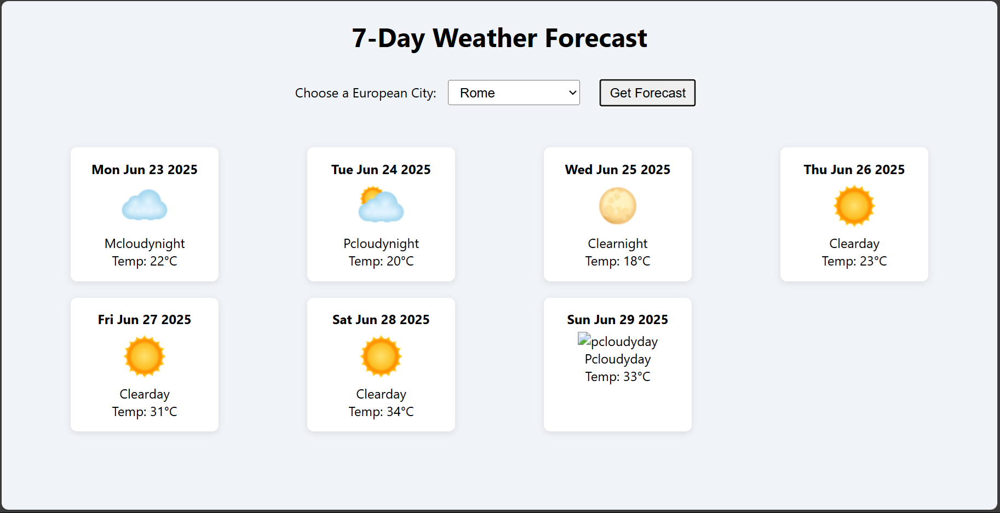

<h1 align="center">🌐 Personal Website</h1>

<p align="center">
  <b>A modern, responsive personal website to showcase your portfolio, projects, and online presence.</b><br/>
  <i>Crafted with HTML, CSS, and JavaScript</i>
</p>

<p align="center">
  <a href="LICENSE"></a>
  
  
</p>

---

## 🚀 Live Site

🔗 **[View Website](https://lakshaykaushik1.github.io/Website/)**

---

## ✨ Features

✅ Elegant and clean design  
✅ Fully responsive for all devices  
✅ Easy to customize and deploy  
✅ Smooth scrolling and transitions  
✅ SEO-optimized structure  

---

## 🧰 Tech Stack

| Tech         | Description                      |
|--------------|----------------------------------|
| 🧱 HTML5      | Markup structure                 |
| 🎨 CSS3       | Styling and responsive layout    |
| ⚙️ JavaScript | Interactivity and animations     |

---

## 🖼️ Preview

<p align="center">
  
</p>

---

## 📦 Installation

```bash
# Clone the repository
git clone https://github.com/lakshaykaushik1/Website.git

# Navigate to the project directory
cd Website

# Open index.html in your browser
